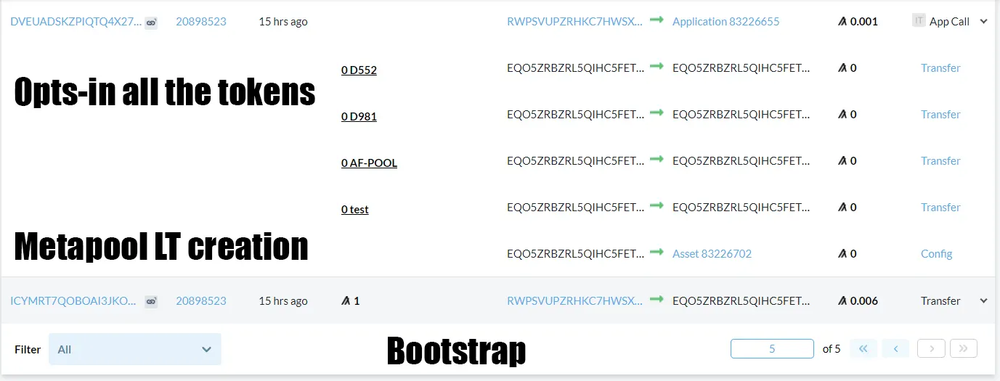
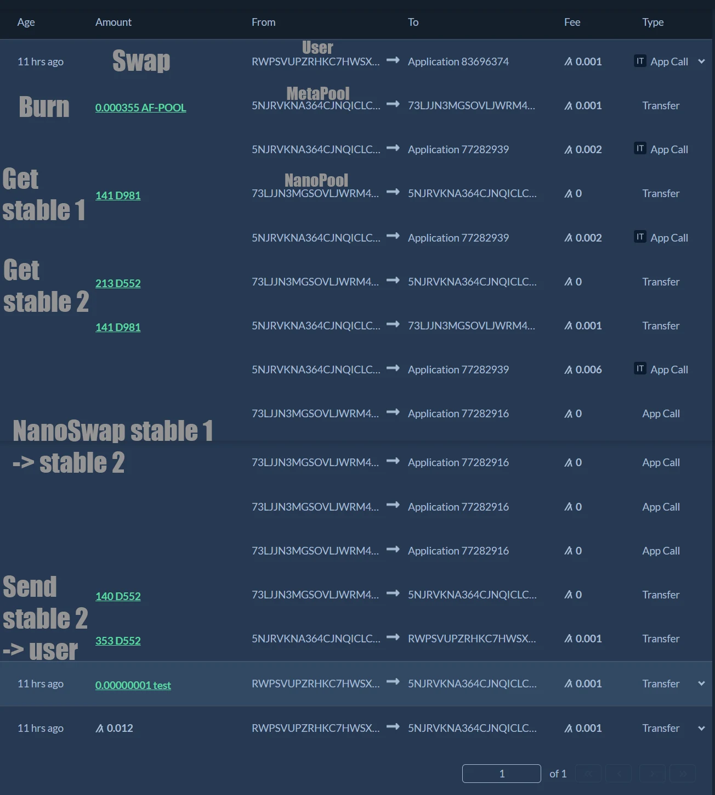
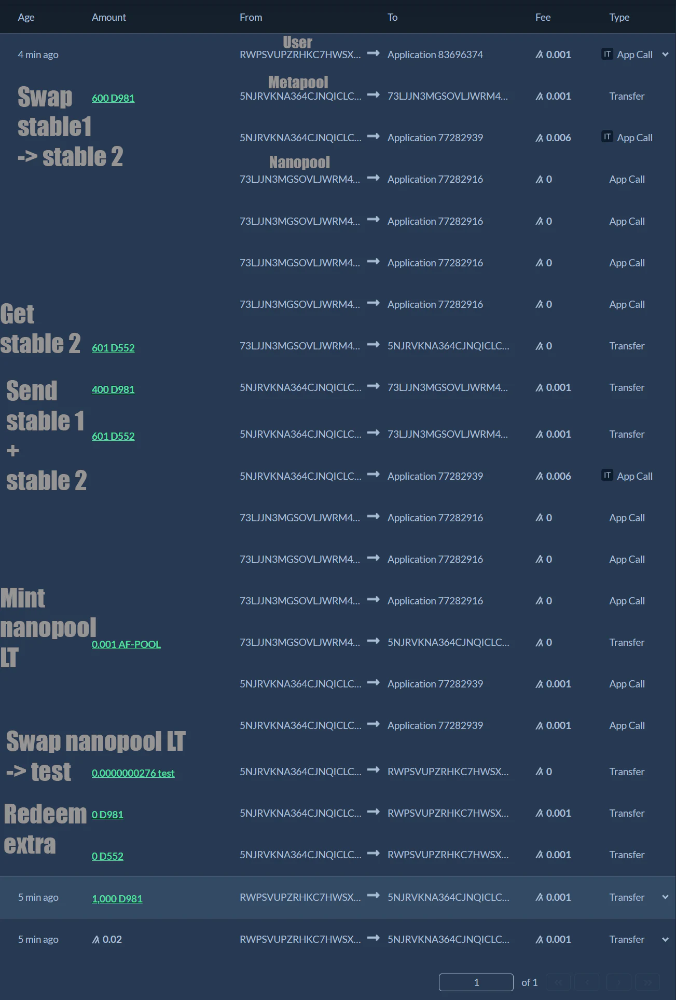
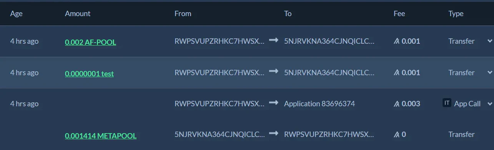
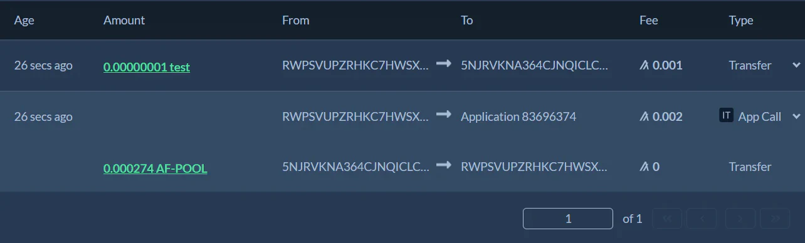
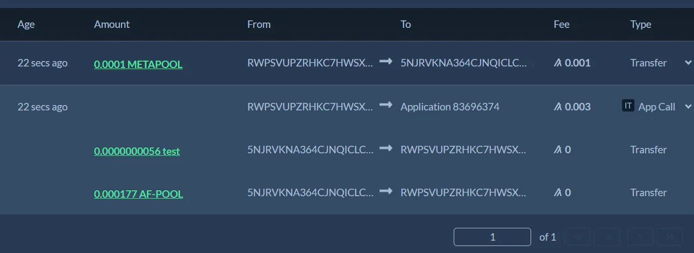

## This is a metapool contract, sdk and testing suite for Algofi's nanopools

### Prerequisites

To run the the project:

- You must have NodeJs installed on your machine.
- Run `npm install` to install all the dependencies in your local folder.
- Create an .env file in the root directory with `Mnemo="Your 25 words"`
- To run the code as is you must opt-in the various testnet tokens and stable coins, the full list is in ./src/constants
- ./algofiSDK regroups convenience functions to mint / swap / burn in the target [D981 - D552 testnet nanopool](https://testnet.algoexplorer.io/address/73LJJN3MGSOVLJWRM4F5ARYT4BYJSIWHE4IAYGWTT7YEGYZXEYFZSO2Q6E)

### General considerations about the contract

In the contract, stable 1 and stable 2 refer to the two stable coins of the target nanopool.

For the nanopools to work optimally they must be called with the right amount of fees, calculated as base fee + extra compute fees. For that reason before metaswaps and metazaps this amount is calculated while getting the quote and then sent in appargs when calling the metapool contract so it can itself dynamically set the proper nanopool fees.

Metaswaps and metazaps have slippage protection in the form of a minimum asset expected, set in app args. If the received amount is below that value the contract will fail.

Metazaps have an extra challenge in that they must get the proper ratio of stable 1 to stable 2 to mint the nanopool liquidity token. This proper ratio is obtained by swapping an appropriate amount of the stable coin sent by the user for the other stable coin.  
The math to accurately estimate the result of a swap in the nanopool is too opcode expensive to be done in the metapool contract and is thus done in the front-end, its result set in appargs. As a backup, if no value is set in appargs, the metapool contract can estimate this amount by treating the nanopool like a regular pool.  
To run these specific estimates I couldn't get the [binarySearch](https://github.com/Algofiorg/algofi-amm-js-sdk/blob/377690b8ea97993900b34a92f113ea63e47f4dd0/src/v0/pool.ts#L492) function from the algofi-amm-js-sdk to work as I wanted so I wrote my own [function](https://github.com/AlgoDoggo/algofi_hackalgo/blob/99e9661408238bb0fee861ddf1a037dbc563abf9/src/utils/stableSwapMath.ts#L238). It only really shines when the stable coins ratio is far off in the nanopool, since the closer the ratio is to 1 : 1 the more the nanopool math is similar to that of a regular pool.

### Deploy a new metapool

`npm run create-app` will deploy a new app with the constants from the relevant folder and bootstrap it. The target nanopool is D981 - D552, the metapool is made of test - AF-NANO-POOL-D981-D552.

Once the contract is deployed, its account is bootstrapped:

- 1 Algo is sent to it
- The account opts-in all the relevant tokens
- A metapool liquidity token is also created with total supply equal to max uint64.

### Using the SDK

By default mint, swap, burn, metaswap and metazap are done with an amount of 1000 and slippage protection turned off. The target stablecoin for metaswaps and metazaps is stable1 (D981). You can change these values in ./index.ts  
Before any trade is executed the sdk will get a quote and log its result.

### Metaswap

`npm run metaswap`

- Test token is sent to the metapool.
- Test is swaped for nanopool liquidity token.
- Nanopool LT is burned in nanopool.
- Metapool gets stable 1 & stable 2 from the nanopool.
- The stable coin we want to redeem is set in app args.
- Swap stable 1 for stable 2 or vice-versa in nanopool.
- Send the stable coin back to user.

### Metazap

`npm run metazap`

- Either stable 1 or stable 2 is sent to the metapool.
- Metapool does a nanoswap such as the resulting stable 1 / stable 2 ratio in the metapool is equal to the nanopool stable 1 supply / stable 2 supply ratio.
- Send stable 1 and stable 2 to the nanopool to mint nanopool liquidity token.
- Swap the nanopool LT for the test token in the metapool and send it back to the user.
- After minting, the nanopool has us redeem any extra stable coins, these amounts are redeemed in the metapool and then sent back to the user.

### Mint Metapool Liquidity Token

`npm run mint`

- For the first mint any ratio can be set
- For subsequent mints the proper ratio must be respected
- If there is any extra token to redeem an additional inner transaction will send it back to the user hence the appl fee is 3x min: call app, get metapool LT, possibly redeem extra token

### Swap test token for nanopool liquidity token, in the metapool

`npm run swap`

### Burn Metapool Liquidity Token

`npm run burn`

### Testing

`npm run test`

Testing is done with mocha and chai.

I have written tests to verify the sdk could handle unusual input types.  
We also test the slippage protection feature in the smart contract.  
Finally we test the smart contract math for each operation type - mint, swap, burn, metaswap, metazap - by doing the same math in the front-end and comparing the outputs.

https://user-images.githubusercontent.com/93348148/163474906-065ff026-8311-47e1-9ed0-e6a9b489b4fc.mp4

### Troubleshoot

Though it shouldn't be necessary, if you have issues running the scripts installing ts-node globally can help: `npm install -g ts-node`

---

### ABI

#### Mint

tx 0 : NoOp appl call

- fee: 3x min
- appArgs: ["mint", maxSlippage]
- foreignAssets: [assetID, nanoLT, metapoolLT]
- appIndex: metapool_app

tx 1 : Axfer asset  
tx 2 : Axfer nanoLT (= nanopool liquidity token)

#### Swap

tx 0 : NoOp appl call

- fee: 2x min
- appArgs: ["swap", minAmountOut]
- foreignAssets: [assetID, nanoLT, metapoolLT]
- appIndex: metapool_app

tx 1 : Axfer either asset or nanoLT

#### Burn

tx 0 : NoOp appl call

- fee: 3x min
- appArgs: [ "burn" ]
- foreignAssets: [assetID, nanoLT, metapoolLT]
- appIndex: metapool_app

tx1 : Axfer metapool LT

#### Metaswap

tx 0 : Pay (8 + extraComputeFee) \* minFee

tx 1 : Axfer asset to metapool

tx 2 : NoOp appl call

- appArgs: [ "metaswap", stableMinReturn, stableOut, extraComputeFee ]
- accounts: [ nanopool_address ]
- foreignAssets: [assetID, nanoLT, stable1, stable2]
- foreignApps: [stable1_stable2_app, managerID_nanoswap]
- appIndex: metapool_app

#### Metazap

tx 0 : Pay (13 + extraFeeSwap + extraFeeMint) \* minFee

tx 1 : Axfer stable 1 or stable 2 to the metapool

tx 2 : NoOp appl call

- appArgs: [ "metazap", minAssetToGet, toConvert, extraFeeSwap, extraFeeMint ]
- accounts: [ nanopool_address ]
- foreignAssets: [assetID, nanoLT, stable1, stable2]
- foreignApps: [stable1_stable2_app, managerID_nanoswap]
- appIndex: metapool_app
