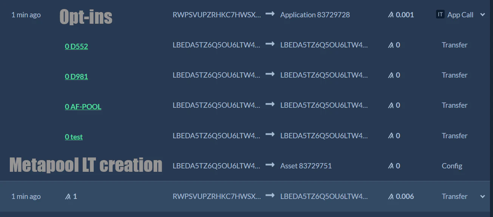

## This is a metapool contract, sdk and testing suite for Algofi's nanopools

### Prerequisites

To run the the project:

- You must have node installed on your local machine.
- Create an .env file in the root directory with `Mnemo="Your 25 words"`
- To run the code as is you must opt-in the various test tokens and stable coins, the full list is in ./constants
- ./algofiSDK regroups convenience functions to mint / swap / burn in the target D981 - D552 testnet nanopool

### Deploy a new metapool

`npm run create-app` will deploy a new app with the constants from the relevant folder and bootstrap it. The target nanopool is D981 - D552, the metapool is made of test - AF-NANO-POOL-D981-D552.

During app creation a metapool liquidity token is also created with total supply equal to max uint64.

### Mint Metapool Liquidity Token

`npm run mint`

- For the first mint any ratio can be set
- For subsequent mints the proper ratio must be respected
- If there is any extra token to redeem an additional inner transaction will send it back to the user hence the appl fee is 3x min: call app, get metapool LT, possibly redeem extra token

### Swap test token for nanopool liquifity token, in the metapool
`npm run swap`

### Burn Metapool Liquidity Token

`npm run burn`

